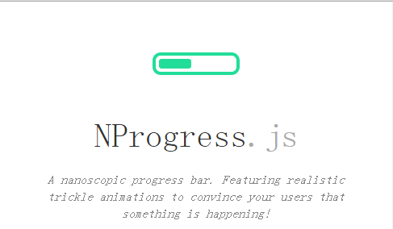

# vuepress 引入nprogress

::: tip  前言
进度条库是前端中常见的库之一，bootstrap中提供了多种进度条样式。NProgress.js和nanobar.js是两款轻量级的进度条组件，使用简便。轩枫阁用过Nprogress，用于页面刚打开时的页面加载进度显示。
:::
## 使用方法
使用方法基本和`vue`中的使用方法一致。
- 安装
```npm
 npm install --save nprogress
```
- 在项目中引入
```javascript
import NProgress from 'nprogress'
import 'nprogress/nprogress.css'
```
- 结合router做跳转使用
```javascript
router.beforeEach((to, from, next) => {
    NProgress.start() //开始
    next()
})
router.afterEach(() => {
    window.scroll(0,0) // 跳转滚动至页面顶部
    NProgress.done() // 结束
});
```

## 在vuepress中遇到的坑
前面一切都是这么的顺利，以为这么快就结束了？:cry: 在vuepress中有一大坑！！！
::: danger 问题呈现
在开发环境中没有问题，但是打包项目`npm run docs:build`的时候会报错。
**ReferenceError: document is not defined**
:::
```md
return !!document.getElementById('nprogress');
    ^

ReferenceError: document is not defined
    at Object.NProgress.isRendered (server-bundle.js:5597:5)
    at Object.NProgress.render (server-bundle.js:5550:19)
```
What? `document is not defined`？ `document`可是浏览器带的API啊，百思不得其解！带着疑惑，笨笨的我开始四处寻找答案，开始在github上问大佬。
[点击链接](https://github.com/vuejs/vuepress/issues/1000)。
大佬就是大佬，一下子就看出了问题所在。

[Browser API Access Restrictions](https://vuepress.vuejs.org/guide/using-vue.html#browser-api-access-restrictions)

### 浏览器API的访问限制
当你在开发一个 VuePress 应用时，由于所有的页面在生成静态 HTML 时都需要通过 Node.js 服务端渲染，因此所有的 Vue 相关代码都应当遵循 [编写通用代码](https://ssr.vuejs.org/zh/universal.html) 的要求。简而言之，请确保只在 `beforeMount` 或者 `mounted` 访问浏览器 / DOM 的 API。

如果你正在使用，或者需要展示一个对于 SSR 不怎么友好的组件（比如包含了自定义指令），你可以将它们包裹在内置的 `<ClientOnly>` 组件中：

``` md
<ClientOnly>
  <NonSSRFriendlyComponent/>
</ClientOnly>
```

请注意，这并不能解决一些组件或库在**导入**时就试图访问浏览器 API 的问题 —— 如果需要使用这样的组件或库，你需要在合适的生命周期钩子中**动态导入**它们：

``` vue
<script>
export default {
  mounted () {
    import('./lib-that-access-window-on-import').then(module => {
      // use code
    })
  }
}
</script>
```
所以我们要在`beforeMount` 或者 `mounted`中动态的导入nprogress。问题解决~:smile:
```vue
<script>
// .vuepress/theme/Layout.vue
export default {
  // ...
  mounted () {
    import('nprogress').then(NProgress => {
      this.$router.beforeEach((to, from, next) => {
        NProgress.start()
        next()
      })
      this.$router.afterEach(() => {
        window.scroll(0,0)
        NProgress.done()
      })
    })
  },
  // ...
}
</script>
```
## 总结
::: tip 谈谈人生
- 其实这个问题可以延伸到很多东西，这里只是以`nprogress`为例，在以后使用这种外部js的时候，如果遇到这种问题，我们都能这样解决。 
- 文档的重要性。这个问题在文档中已经提到过，可能也是没有想到是这个原因，不过文档还是个好东西。
- 作为全球最大的同性交友网站**github**，真的算是一个最具权威，效率最高的解决问题的平台了。
- **github**多数还是英文比较多，所以学英语学英语学英语。
:::
<template>
  <page-nav type="blog"></page-nav>
</template>